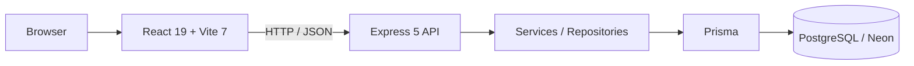

<div align="center">

# Vittae

### Tecnologia para profissionais do bem-estar

Plataforma SaaS em desenvolvimento para ajudar profissionais autônomos do bem-estar a organizar sua presença digital, clientes, agenda e operação em um único lugar.

**Showcase técnico · código-fonte principal mantido em repositório privado**

</div>

---

## Sobre o projeto

Muitos profissionais autônomos do bem-estar ainda concentram sua operação em ferramentas como WhatsApp e Instagram. Isso pode tornar agenda, clientes, serviços, comunicação e controle do negócio difíceis de organizar conforme a operação cresce.

A **Vittae** nasceu como uma proposta de plataforma única para transformar essa rotina em uma experiência mais organizada e profissional, tanto para quem presta o serviço quanto para quem agenda.

> Este repositório é uma vitrine pública do projeto. O código-fonte principal permanece privado. Aqui estão documentados produto, arquitetura, decisões técnicas, telas e evolução do desenvolvimento sem expor credenciais, dados reais ou implementação sensível.

---

## Estado atual

A Vittae está em **desenvolvimento ativo**.

Hoje, o projeto já possui:

- frontend em React/Vite com navegação e interface do produto;
- autenticação real integrada entre frontend e backend;
- API Express independente;
- PostgreSQL em ambiente de desenvolvimento via Neon;
- domínio modelado com Prisma;
- testes automatizados de frontend, backend e integrações selecionadas;
- dashboard protegido por autenticação;
- busca, filtros, perfil profissional, agendamento e voucher em modo demonstrativo.

Os módulos de negócio — como reserva persistida, pagamentos, notificações e operação completa da agenda — **ainda não são funcionalidades de produção**. Nessas áreas, a interface atual é uma demonstração do produto e da experiência planejada.

---

## Visão do produto

### Para clientes

- descobrir profissionais;
- visualizar perfis e serviços;
- escolher data e horário;
- acompanhar a experiência de agendamento;
- adquirir vouchers;
- avaliar serviços.

### Para profissionais

- manter um perfil profissional;
- organizar serviços e agenda;
- acompanhar clientes;
- visualizar indicadores do negócio;
- gerenciar vouchers;
- evoluir para uma operação digital centralizada.

---

## Telas

### Landing page


### Perfil profissional


### Dashboard


### Voucher


### Descoberta de profissionais


---

## Arquitetura



O frontend e o backend foram mantidos como camadas independentes. A interface consome a API real nos fluxos de autenticação, enquanto os módulos de negócio ainda utilizam dados demonstrativos até que seus respectivos endpoints sejam implementados.

Mais detalhes em [`docs/ARCHITECTURE.md`](docs/ARCHITECTURE.md).

---

## Stack

### Frontend

- React 19
- Vite 7
- React Router DOM 7
- JavaScript / JSX / ESM
- CSS autoral
- Lucide React
- Playwright em integração selecionada
- Node.js native test runner

### Backend

- Node.js
- Express 5
- Prisma 7
- PostgreSQL / Neon
- Zod
- Pino
- Helmet
- CORS
- Express Rate Limit
- Argon2id
- JOSE / JWT

### Engenharia

- separação entre aplicação HTTP e listener;
- validação de ambiente;
- health e readiness checks;
- respostas de erro padronizadas;
- logs estruturados;
- migrations e constraints de banco;
- testes sem depender do banco para a suíte principal;
- integrações reais opt-in para PostgreSQL e autenticação.

---

## Autenticação

A autenticação é uma das partes já integradas de ponta a ponta.

O fluxo atualmente inclui:

- cadastro e login reais;
- hashing de senha com Argon2id;
- access token de curta duração;
- refresh token opaco em cookie `HttpOnly`;
- rotação e revogação de sessão;
- logout da sessão atual e logout global;
- restauração de sessão no frontend;
- proteção das rotas do dashboard;
- coordenação de sessão entre abas;
- CORS e validação de origem;
- rate limiting em endpoints sensíveis.

Recuperação e verificação de e-mail fazem parte da evolução planejada e ainda não são apresentadas como concluídas.

---

## Modelagem de domínio

O backend possui um domínio relacional preparado para a evolução do produto, incluindo conceitos como:

- usuários e perfis;
- profissionais;
- serviços;
- clientes;
- disponibilidade;
- agendamentos;
- vouchers;
- avaliações;
- pagamentos e assinaturas;
- sessões e tokens relacionados à autenticação.

A modelagem já foi validada em PostgreSQL de desenvolvimento, mas **modelagem não significa que todos esses fluxos estejam operacionais no produto**. A implementação é liberada por domínio, substituindo gradualmente os mocks do frontend por operações persistidas.

---

## Qualidade e segurança

Algumas decisões adotadas no projeto:

- secrets mantidos exclusivamente no backend;
- arquivos `.env` fora do versionamento;
- payload JSON limitado;
- CORS com origem explícita;
- headers de segurança com Helmet;
- rate limiting;
- validação com Zod;
- logs sem credenciais ou objetos brutos;
- tokens de autenticação tratados de forma diferente entre browser e servidor;
- integridade de domínio reforçada também no PostgreSQL;
- dados pessoais não são colocados em URLs no fluxo demonstrativo de agendamento.

---

## O que é real e o que ainda é demo

| Área | Estado atual |
| --- | --- |
| Interface e navegação | Implementado |
| Busca e filtros sobre catálogo demonstrativo | Implementado |
| Autenticação frontend + backend | Implementado |
| PostgreSQL de desenvolvimento + Prisma | Implementado |
| Dashboard protegido | Implementado |
| Perfis e serviços de negócio | Demo / dados ilustrativos |
| Agendamento persistido | Planejado |
| Gestão real de agenda e clientes | Planejado |
| Pagamentos e assinaturas | Planejado |
| Emissão e resgate real de vouchers | Planejado |
| Notificações e e-mails transacionais | Planejado |
| Deploy público de produção | Não realizado |

Veja a visão mais detalhada em [`docs/STATUS.md`](docs/STATUS.md).

---

## Roadmap

```text
Produto / UX
   ↓
Demo navegável
   ↓
Fundação backend
   ↓
Modelagem PostgreSQL
   ↓
Autenticação full stack
   ↓
Recuperação e verificação de e-mail
   ↓
APIs de negócio
   ↓
Agenda e clientes persistidos
   ↓
Pagamentos / vouchers / notificações
   ↓
Beta
```

---

## Objetivos técnicos do projeto

Além do produto em si, a Vittae é usada para aprofundar práticas de desenvolvimento full stack, entre elas:

- arquitetura por camadas;
- desenho de APIs;
- autenticação e sessões;
- bancos relacionais e integridade de dados;
- modelagem multi-entidade;
- testes unitários e de integração;
- segurança de aplicações web;
- evolução incremental de uma demo para um SaaS real.

---

## Sobre este showcase

O objetivo deste repositório é permitir que recrutadores, desenvolvedores e pessoas interessadas no projeto entendam **o problema, o produto, a arquitetura e a evolução técnica da Vittae** sem que seja necessário abrir o código-fonte principal.

O repositório privado continua sendo a fonte de verdade da implementação.

---

<div align="center">

**Vittae · em desenvolvimento**

</div>
