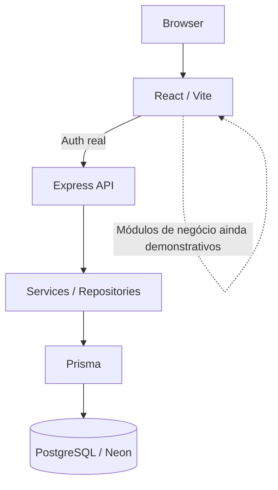

# Arquitetura — Vittae

## Visão geral

A Vittae é organizada em duas aplicações principais: um frontend React/Vite e uma API Express. O banco relacional é PostgreSQL, acessado pelo backend através do Prisma.



## Frontend

Tecnologias principais:

- React 19;
- Vite 7;
- React Router DOM 7;
- JavaScript/JSX ESM;
- CSS autoral;
- Lucide React.

A SPA possui páginas públicas, marketplace, perfil profissional, fluxo demonstrativo de agendamento, voucher, autenticação, dashboard protegido, páginas institucionais e tratamento de rota não encontrada.

Busca, filtros e ordenação operam sobre um catálogo demonstrativo. O fluxo de autenticação, por outro lado, já conversa com a API real.

## Backend

A API utiliza:

- Node.js;
- Express 5;
- Zod para configuração e validação;
- Helmet;
- CORS explícito;
- rate limiting;
- Pino para logs estruturados;
- Prisma para acesso ao banco.

A aplicação HTTP é criada separadamente do listener, favorecendo testes e encerramento controlado do processo.

O backend segue, em linhas gerais:

```text
Routes
  ↓
Validators / Middlewares
  ↓
Controllers
  ↓
Services
  ↓
Repositories
  ↓
Prisma
  ↓
PostgreSQL
```

## Health e readiness

A API diferencia os conceitos de liveness e readiness:

- **health:** indica que a aplicação está viva sem depender do banco;
- **ready:** verifica se as dependências necessárias estão disponíveis, incluindo conexão com o PostgreSQL.

Isso evita tratar indisponibilidade de uma dependência externa como se o processo HTTP não estivesse vivo.

## Autenticação

O núcleo de autenticação já está integrado entre frontend, backend e banco.

Principais decisões:

- senhas armazenadas com Argon2id;
- JWT para access token;
- refresh token opaco armazenado no browser em cookie `HttpOnly`;
- hash do refresh persistido no servidor;
- rotação e revogação de sessão;
- endpoints de cadastro, login, refresh, logout, logout global e leitura da sessão atual;
- validação de origem para operações de autenticação;
- CORS com credentials e origem explícita;
- proteção de rotas do dashboard no frontend;
- access token mantido em memória no browser.

## Sessão no frontend

O frontend evita persistir o access token em `localStorage`.

A restauração da sessão usa o cookie HttpOnly por meio do backend. A aplicação também possui mecanismos de coordenação para evitar operações concorrentes desnecessárias e para propagar alterações de sessão entre abas do mesmo site.

## Banco de dados

O PostgreSQL de desenvolvimento está provisionado no Neon e é acessado via Prisma.

O domínio contém entidades relacionadas a:

- identidade e autenticação;
- profissionais e perfis;
- clientes;
- serviços;
- disponibilidade;
- agendamentos;
- vouchers;
- avaliações;
- pagamentos e assinaturas.

Constraints e relações no banco complementam as validações da aplicação. Ainda assim, a existência dessas tabelas não é apresentada como evidência de que todos os fluxos de negócio estejam implementados.

## Estratégia de evolução

A Vittae está sendo desenvolvida incrementalmente:

1. experiência de produto e fluxo navegável;
2. organização e testes da demo;
3. fundação do backend;
4. modelagem do domínio e PostgreSQL;
5. autenticação real;
6. substituição gradual dos mocks por APIs de negócio;
7. integrações externas e operação beta.

Essa abordagem permite validar a experiência e a arquitetura sem confundir protótipo de interface com funcionalidade operacional.
